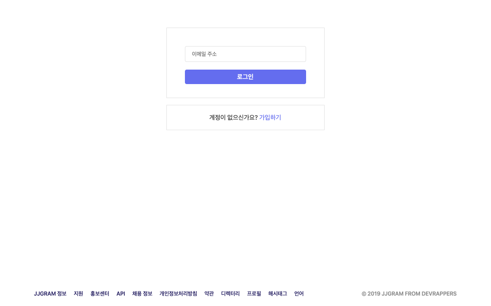
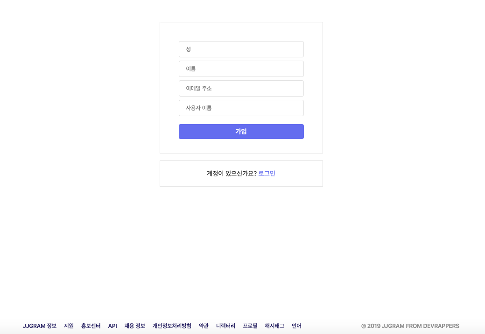
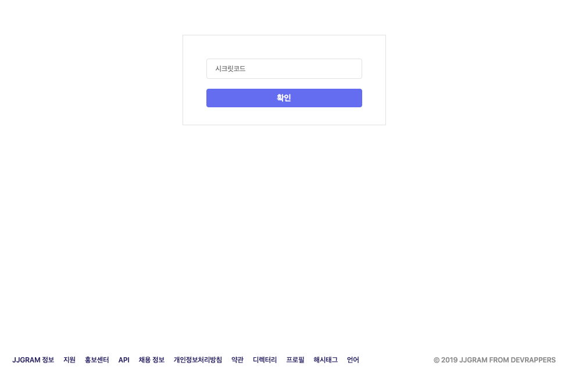
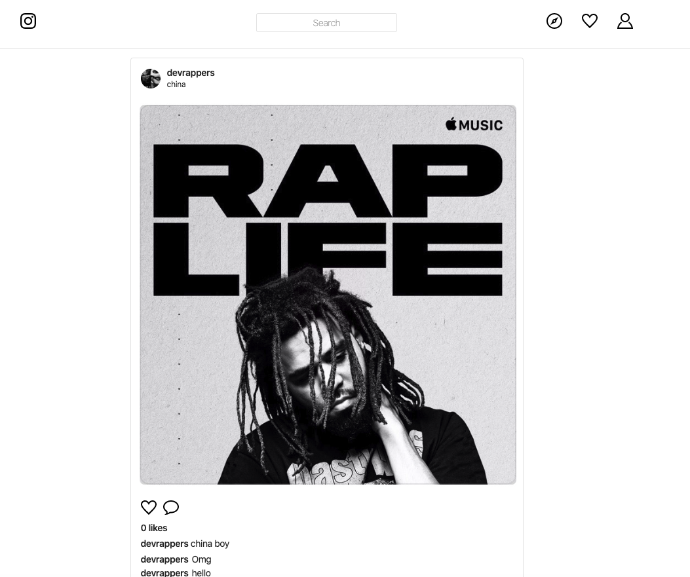
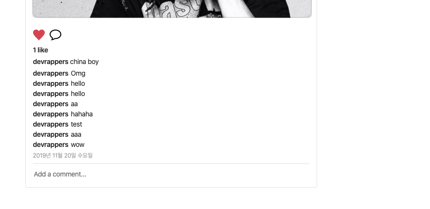
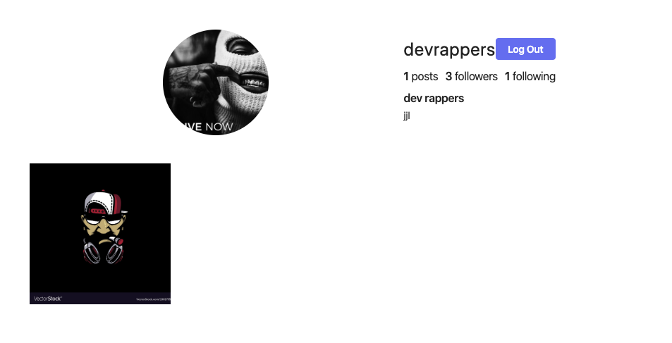
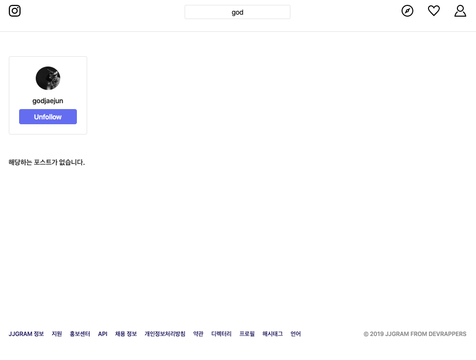

# JJGram Frontend
React + Hooks + GraphQL + apollo를 활용해 만든 인스타그램 클론 프론트앤드(Web)

## 프로젝트 실행방법
1. JJGRAM Backend프로젝트를 클론한 후 yarn dev로 서버를 실행시켜줌.
2. jjgram-frontend를 git clone해줌
3. clone이 완료되었으면 npm install 명령어 입력
4. yarn start 후 프로젝트 사용

## 스크린샷
### 🔒 Auth
로그인(이메일 인증) 및 회원가입(페이스북,이메일,구글)

    
    
    

### 😯 Feed + Post + Profile
첫 화면으로 만나는 Feed화면과 검색을 통해 User, Post를 찾고 상세페이지를 확인하는 것과 profile

    
    

    
    

